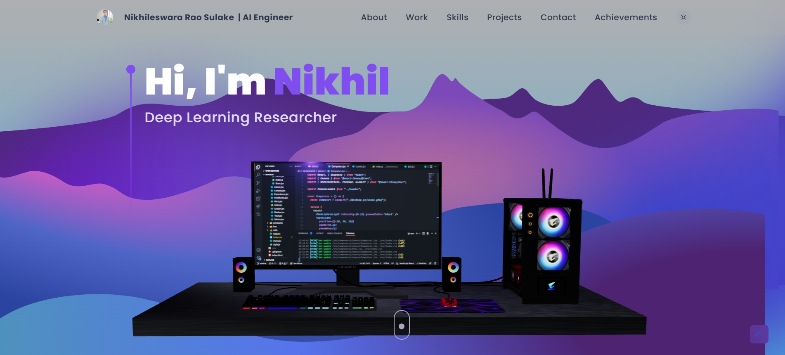
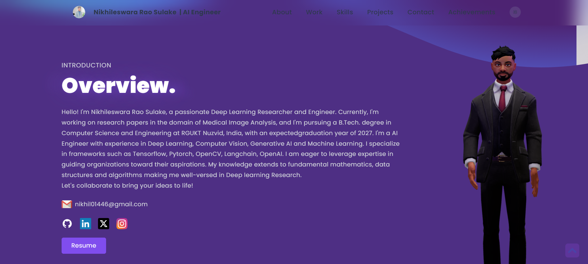
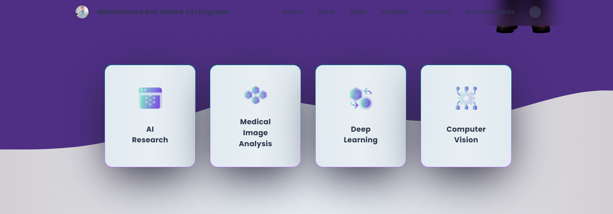
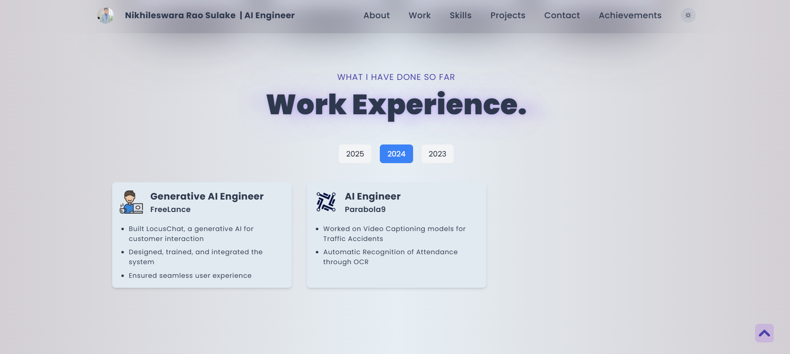
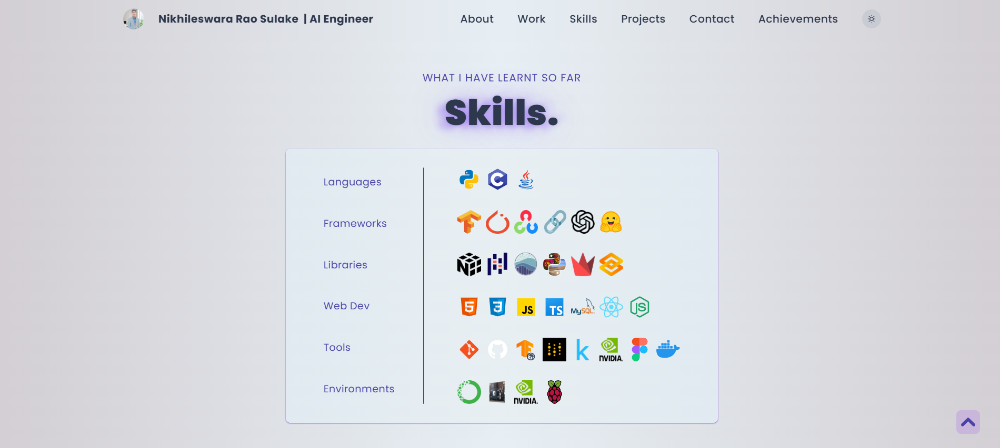
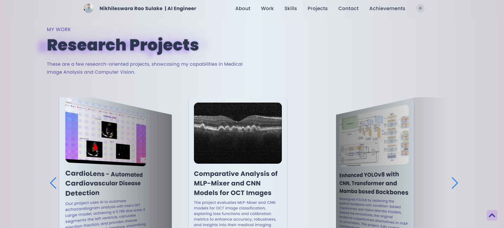
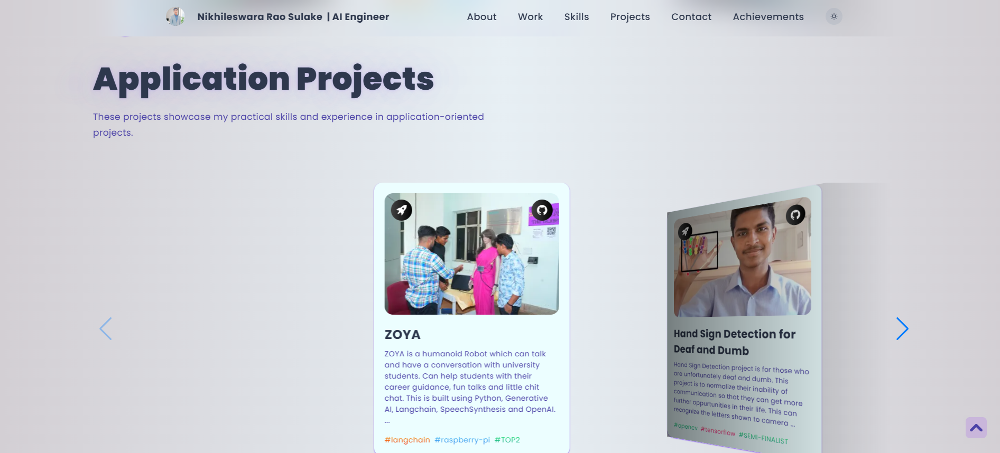
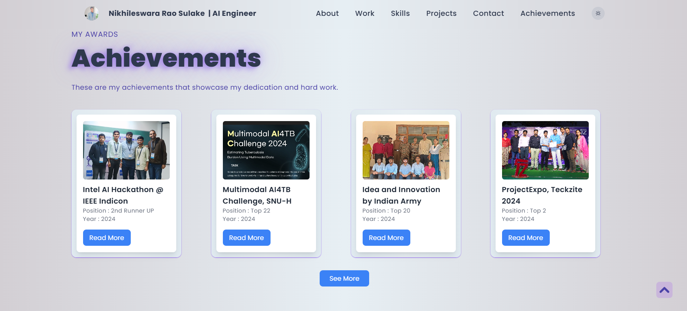
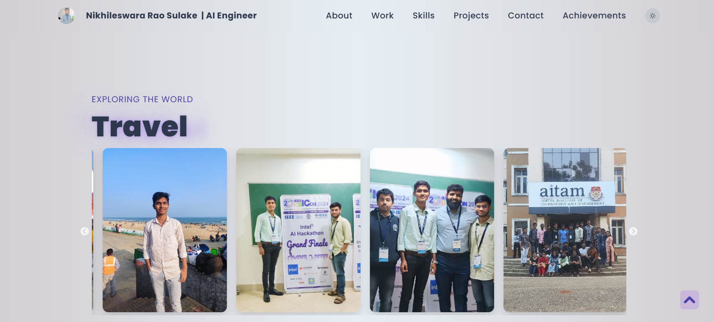
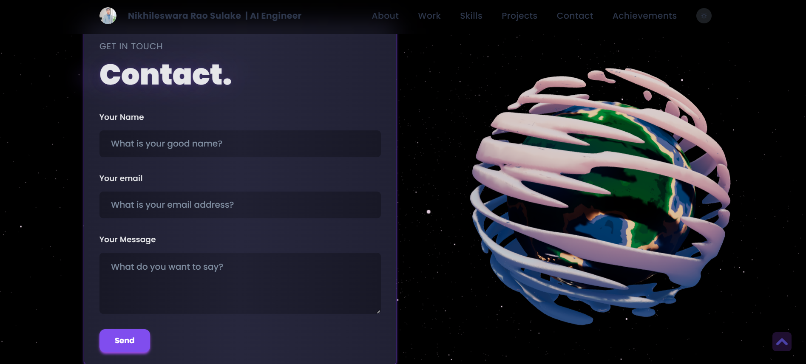

# 🚀 Nikhil Rao Portfolio

🌐 **Live Site:** [nikhil-rao-sulake.netlify.app](https://nikhil-rao-sulake.netlify.app/)  

Welcome to my **personal portfolio website**, where I showcase my **skills, projects, and achievements** in **Artificial Intelligence, Deep Learning, and Computer Vision**. This website serves as a **digital resume and portfolio**, highlighting my journey in **AI/ML research, engineering, and innovation**.

---

## 🎯 About the Portfolio  
This portfolio is a **modern, interactive, and fully responsive** website built to:  
✅ Showcase my **technical expertise and projects**  
✅ Highlight my **AI/ML research contributions**  
✅ Provide insights into my **professional experience and certifications**  
✅ Offer an **easy way to connect with me**  

The website is designed with **aesthetic UI/UX principles**, ensuring a smooth and engaging user experience.

---

## 🛠️ Tech Stack  
This portfolio is built using **cutting-edge web technologies**, ensuring performance and scalability:  

- **Frontend:** React.js, Tailwind CSS  
- **Animations & UI:** Framer Motion, Shadcn/UI  
- **Deployment:** Netlify  

---

## 📌 Features  
✨ **Fully Responsive** – Works seamlessly on **desktop, tablet, and mobile**  
🎨 **Modern UI/UX Design** – Clean, minimal, and intuitive interface  
📂 **Dynamic Project Showcase** – Highlights key projects with interactive previews  
📝 **Blog & Articles** – Shares insights on AI, Deep Learning, and research work  
🔗 **Social Media Links** – Easy access to my **LinkedIn, GitHub, and other platforms**  
📧 **Contact Section** – Connect with me via **email and social handles**  

---

## 📸 Preview  

  
  
  
  
  
  
  
  
  
  
*📌 A sneak peek of my portfolio homepage*  

---

## 🏗️ Folder Structure  

```bash
📂 Nikhil-Rao-Portfolio
│── 📁 src                # Source code for components and pages
│── 📁 public             # Static assets (images, icons)
│── 📁 components         # Reusable React components
│── 📁 styles             # Global and component-level styles
│── 📁 assets             # Images, icons, and other assets
│── 📜 README.md          # Project documentation
│── 📜 package.json       # Dependencies and scripts
│── 📜 netlify.toml       # Deployment configuration
│── 📜 .gitignore         # Git ignored files
